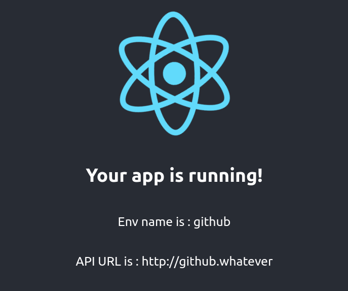

# React : Deploy with one build 

How to manage multiple deployments with the same Build

## Example 

App deployed on Github pages with custom env : `envName` and `apiUrl` 




## Installation

```shell
yarn 
```

### Usage

Start  

```shell
yarn start
```

Test 

```shell
yarn test
```

Build 

```shell
yarn  build
```

## Deploy


Use `gh-pages` node module to deploy to github pages


```shell
npm run deploy:gh
```

To customize application `name` and `api URL`, we replaced `/dist/env.js` by `/deploy/github.env.js`


